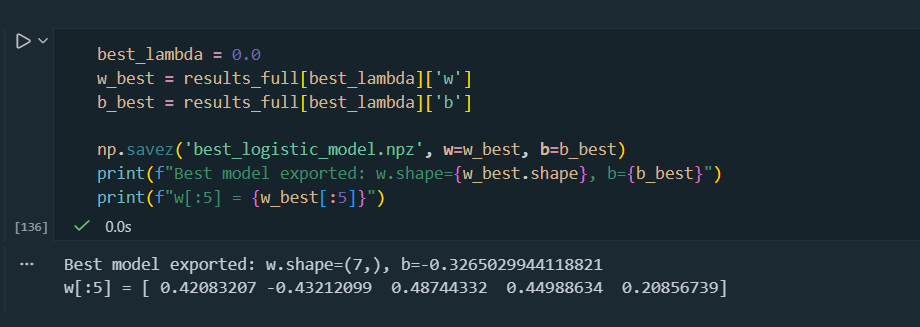
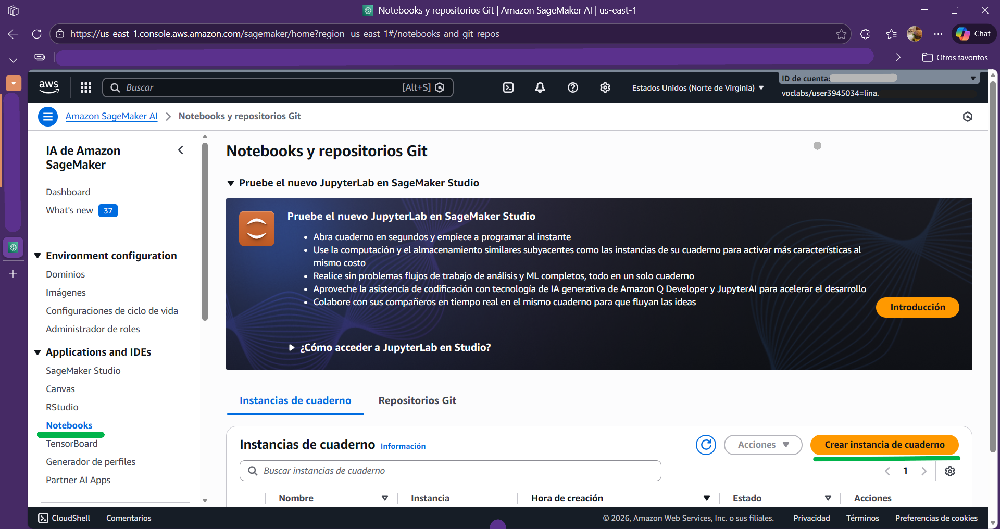
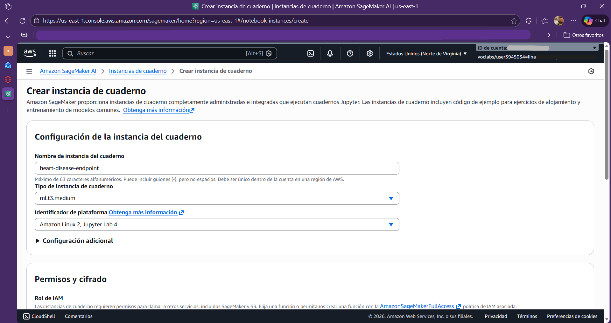
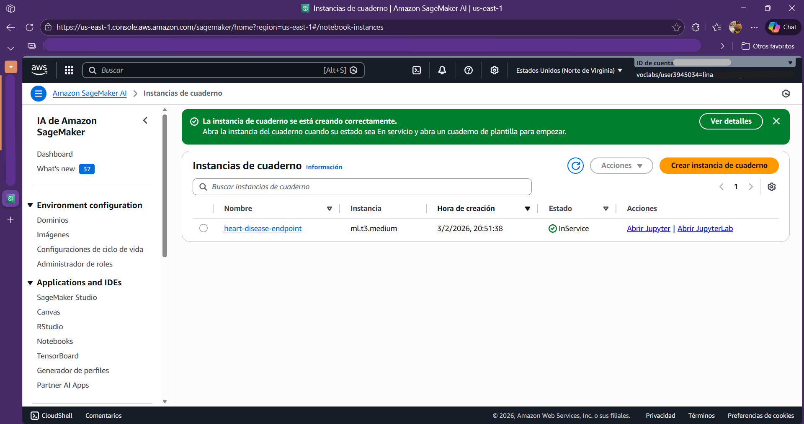
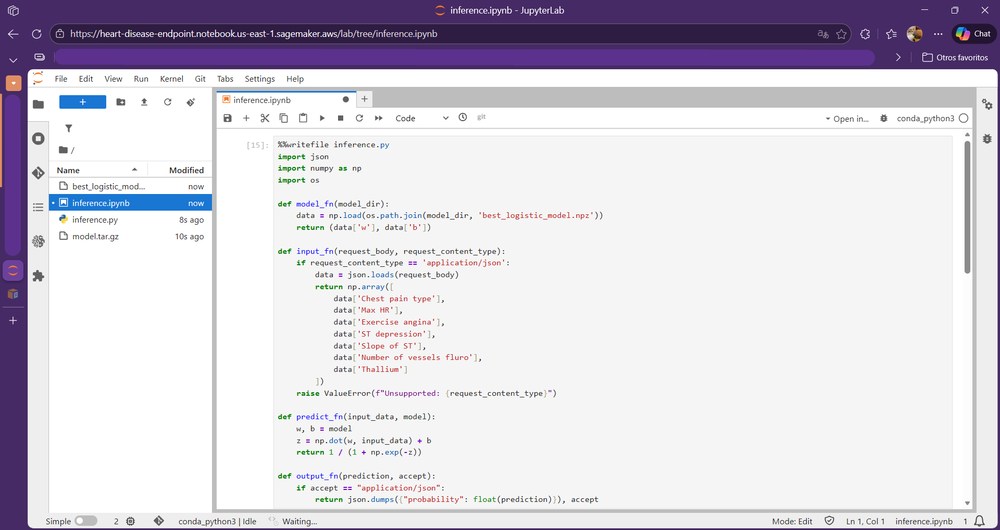
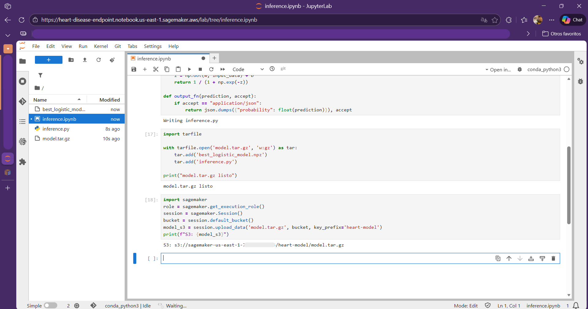
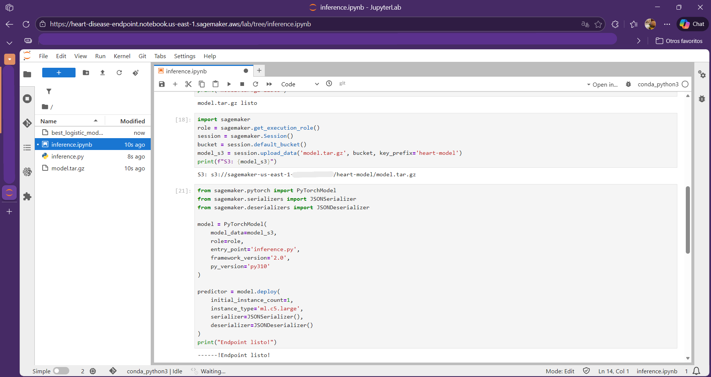
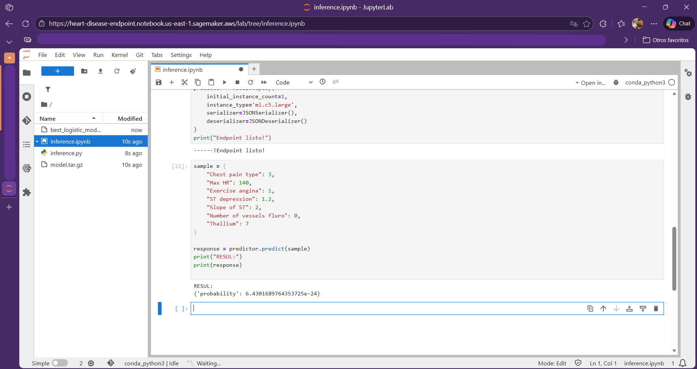

# Heart disease risk prediction – Logistic regression

## Project overview
This project implements **Logistic Regression from scratch** to predict the risk of heart disease using clinical data. The goal is to apply theoretical machine learning concepts such as gradient descent, cost functions, and regularization to a healthcare dataset, and to explore how such a model could be deployed in a production-like environment using **Amazon SageMaker**.

## Dataset description
- **Source:** Kaggle – Heart Disease Dataset  
  https://www.kaggle.com/datasets/neurocipher/heartdisease
- **Samples:** 270 patients

### Features 

14 clinical attributes

- **Age**: Age of the patient (in years)
- **Sex**: Gender of the patient  
  - `1` = Male  
  - `0` = Female
- **Chest pain type**: Type of chest pain experienced  
  - `1` = Typical angina  
  - `2` = Atypical angina  
  - `3` = Non-anginal pain  
  - `4` = Asymptomatic
- **BP**: Resting blood pressure (mm Hg)
- **Cholesterol**: Serum cholesterol level (mg/dL)
- **FBS over 120**: Fasting Blood Sugar over 120 mg/dL  
  - `1` = True  
  - `0` = False
- **EKG Results**: Resting electrocardiogram results
  - `0` = Normal  
  - `1` = ST-T wave abnormality  
  - `2` = Left ventricular hypertrophy
- **Max HR**: Maximum heart rate achieved
- **Exercise angina**: Exercise induced angina
  - `1` = Yes  
  - `0` = No
- **ST Depression**: ST depression induced by exercise relative to rest
- **Slope of ST**: Slope of the peak exercise ST segment
- **Number of vessels**: Number of major vessels colored by fluoroscopy (0–3)
- **Thallium**: Thallium stress test result (categorical medical indicator)

### Target Variable

- **Heart Disease**  
  - `1` = Presence of heart disease  
  - `0` = Absence of heart disease

## Exercise summary

### 1. Data loading & preprocessing
- Dataset downloaded from Kaggle and loaded with Pandas
- Binary encoding of target variable
- Exploratory Data Analysis (EDA):
  - Summary statistics
  - Class distribution
  - Missing value and outlier inspection
- Feature normalization
- Stratified 70/30 train-test split

### 2. Logistic regression implementation
Implemented using NumPy:
- Sigmoid function
- Binary cross-entropy cost function
- Gradient Descent optimization
- Cost tracking across iterations

**Training details:**
- Learning rate: ~0.01  
- Iterations: 1000

**Evaluation metrics:**
- Accuracy
- Precision
- Recall
- F1-score

### 3. Decision boundary visualization
To understand feature separability, models were trained on selected **2D feature pairs**, including:
- Age vs. Cholesterol
- Age vs. Max HR                  
- Age vs. ST depression    
- BP vs. Cholesterol          
- BP vs. Max HR       
- Cholesterol vs. Max HR
- Max HR vs. ST depression

Each pair includes:
- Scatter plot of true labels
- Logistic regression decision boundary

### 4. Regularization (L2)
L2 regularization was added to the cost function and gradients to reduce overfitting.

- Tested λ values: `[0, 0.001, 0.01, 0.1, 1]`
- Compared:
  - Cost convergence
  - Weight magnitudes
  - Decision boundaries (regularized vs. unregularized)

## Deployment exploration: Amazon SageMaker

### Steps

**1. Saved trained weights and bias as NumPy arrays**  
The trained logistic regression parameters were saved locally for deployment.

**2. Created a SageMaker notebook instance**  
A SageMaker notebook instance was created to manage model packaging and deployment.

**3. Uploaded training script and model artifacts**  
The inference script and trained model were packaged into `model.tar.gz` and uploaded to Amazon S3.

**4. Deployed a real-time inference endpoint**  
The model was deployed as a real-time endpoint using a PyTorch container in SageMaker.

**5. Tested the endpoint with sample patient data**  
The deployed endpoint was tested with sample inputs, returning a probability score for heart disease risk.

