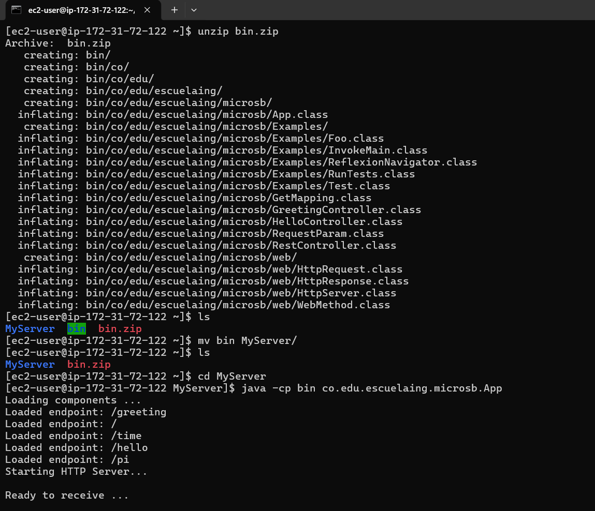
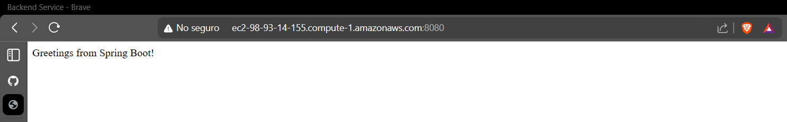
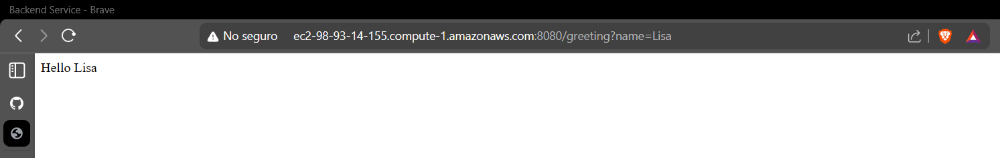

# MicroSpringBoot 

This project is a lightweight Java microframework inspired by Spring Boot.
It was developed as an academic exercise to demonstrate core backend framework concepts such as:

- **Inversion of Control (IoC)**
- **Reflection**
- **Annotation-based routing**

The framework allows developers to define REST endpoints using annotations similar to Spring Boot, while the framework dynamically discovers controllers and invokes the appropriate methods at runtime.

## Architecture

The architecture of MicroSB is based on a simple modular design that separates the HTTP server, the framework core, and the application controllers.

The **HTTP Server** is responsible for receiving requests through a socket connection, parsing the request path and query parameters, and forwarding the request to the framework routing system.

The **framework** uses Java Reflection to scan the compiled classes in the project and detect components annotated with `@RestController`. Methods annotated with `@GetMapping` are registered as available endpoints.

When a request is received, the framework searches for the corresponding method, extracts parameters annotated with `@RequestParam`, and invokes the method dynamically.

Controllers represent the **application layer**, where developers define endpoints using annotations without worrying about the internal server logic.

The overall flow of a request is:

1. Client sends an HTTP request
2. `HttpServer` receives and parses the request
3. The framework searches for a matching endpoint
4. Query parameters are extracted
5. The controller method is invoked using reflection
6. The returned value is sent back as an HTTP response

## Running the project

### 1. Clone the repository
```bash
git clone https://github.com/lisaforero/AREP.git
cd AREP
cd MicroSpringBoot
```
### 2. Compile the project
```bash
mvn clean package
```
### 3. Run the server
```bash
mvn exec:java
```
When the server starts you should see something similar to:
```bash
Loading components ...
Loaded endpoint: /greeting
Loaded endpoint: /
Loaded endpoint: /time
Loaded endpoint: /pi
Loaded endpoint: /hello
Starting HTTP Server...

Ready to receive ...
```

### 4. Test the endpoint
Open your browser and navigate to:
```bash
http://localhost:8080/greeting
```
Response:
```bash
Hello World
```
You can also send parameters in the URL:
```bash
http://localhost:8080/greeting?name=Lisa
```
Response:
```bash
Hello Lisa
```

## AWS deployment evidence

This section contains the evidence of deploying the MicroSB server on an AWS instance.






