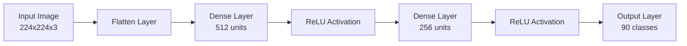
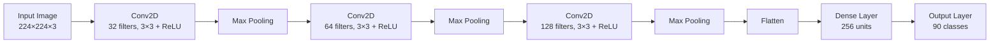

# Exploring Convolutional Layers Through Data and Experiments

## Problem description

This project addresses an image classification problem using neural networks. The goal is to classify animal images into one of 90 different categories.

The main objective of the assignment is not only to achieve high accuracy, but to understand how different neural network architectures behave when applied to image data. In particular, the project compares:

A fully connected neural network (baseline)

A convolutional neural network (CNN)

## Dataset description

The selected dataset is the Animal Image Dataset (90 Different Animals) from Kaggle (https://www.kaggle.com/datasets/iamsouravbanerjee/animal-image-dataset-90-different-animals).

**Main characteristics:**

- 90 animal classes

- Approximately 60 images per class

- Total size: around 5400 images

- Color images (RGB)

- Different resolutions and formats

**Preprocessing**

Before training, the following preprocessing steps were applied:

- All images were resized to 224 × 224 pixels

- Converted to tensors

- Normalized using standard ImageNet mean and standard deviation

The dataset was split into training and validation sets to evaluate generalization performance.

This dataset was chosen because:

- It contains natural image data

- It is complex enough to require feature learning

- It is appropriate for convolutional architectures

## Architecture diagrams

**Baseline Model – Fully Connected Network**

- No convolutional layers

- Treats images as simple vectors

**Convolutional Neural Network (CNN)**

This architecture preserves spatial structure and learns hierarchical visual features.

## Experimental results

**Baseline Model**

- Parameters: 77225306

- Validation Accuracy: 2.31%

- Loss remained around the value expected for random guessing.

- The baseline model was unable to learn meaningful patterns from image data.

**CNN – Base Configuration**

- Filters: 32 → 64 → 128

- Parameters: 25806746

- Final Validation Accuracy: 34.72%

- This model clearly outperformed the baseline.

**Controlled Experiment – Number of Filters**

A second CNN was trained with fewer filters:

- Filters: 16 → 32 → 64

- Parameters: 12892026

- Final Validation Accuracy: 39.63%

- Reducing the number of filters improved generalization while decreasing computational cost.

## Conclusions

The experiments demonstrate that convolutional layers are significantly more effective than fully connected layers for image classification.

Flattening images destroys spatial relationships, which explains the poor performance of the baseline model.

Convolutional layers preserve image structure and learn local patterns such as edges and shapes.

Parameter sharing and local connectivity allow CNNs to generalize better with fewer parameters.

More parameters do not always mean better performance; choosing the right model capacity is crucial.

Architectural design decisions strongly influence learning behavior and final results.

In addition to these summarized findings, the accompanying notebook contains detailed analyses for exploring for deeper insights.
