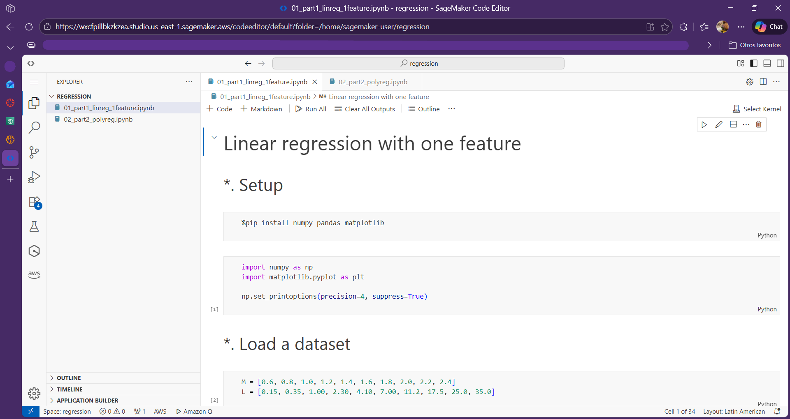
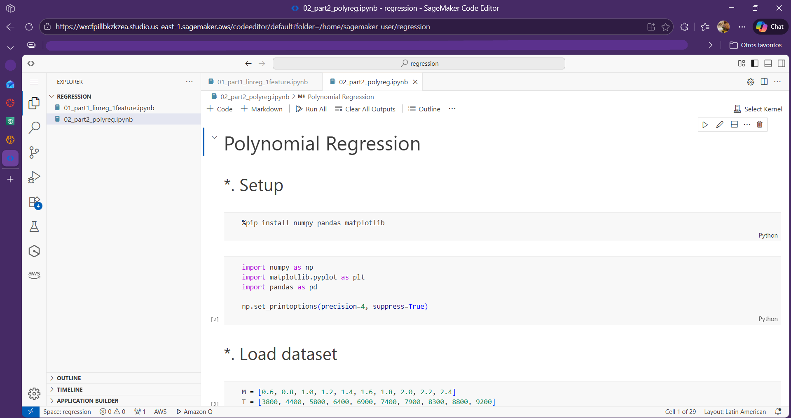
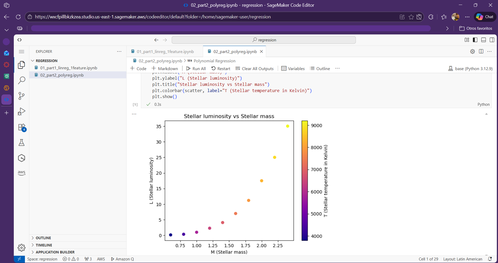

# Stellar luminosity – Linear and polynomial regression

## Repository Contents

This repository contains the solution to the homework **“Stellar luminosity: Linear and polynomial models for regression.”**

All code is implemented inside the Jupyter notebooks.  
All datasets are defined as hard-coded NumPy arrays within the notebooks.  
Only Python, NumPy, and Matplotlib are used.

## Notebook 1: Linear regression with one feature

**File:** `01_part1_linreg_1feature.ipynb`

This notebook implements linear regression from first principles to model stellar luminosity as a function of stellar mass:

$\hat{L} = w M + b$

The notebook includes:
- Visualization of the dataset (M vs L)
- Definition of the hypothesis function and mean squared error (MSE) loss
- Cost surface evaluation over parameters $w$ and $b$
- Analytical gradient derivation
- Gradient descent implementation:
  - Non-vectorized (explicit loop)
  - Vectorized (NumPy)
- Convergence analysis for different learning rates
- Final regression fit and discussion of model limitations

## Notebook 2: Polynomial regression

**File:** `02_part2_polyreg.ipynb`

This notebook extends the linear model using polynomial feature engineering:

$\hat{L} = X w + b$

where the design matrix is:

$X = [M, T, M^2, M \cdot T]$

The notebook includes:
- Dataset visualization with temperature encoding
- Vectorized construction of the design matrix
- Vectorized loss and gradient computation
- Gradient descent training
- Feature selection comparison:
  - M1: $X = [M, T]$
  - M2: $X = [M, T, M^2]$
  - M3: $X = [M, T, M^2, M \cdot T]$
- Analysis of the interaction term contribution
- Prediction (inference) for a new stellar example

## AWS SageMaker execution evidence

Both notebooks were uploaded to **AWS SageMaker** and executed successfully.  
All cells ran without errors and produced the expected outputs and plots.

### Screenshots

- Both notebooks visible/open in SageMaker

- Successful execution with cell outputs

- At least one plot rendered in SageMaker

### Local vs SageMaker execution

No significant differences were observed between local execution and AWS SageMaker execution. Results, convergence behavior, and plots were consistent across both environments.
