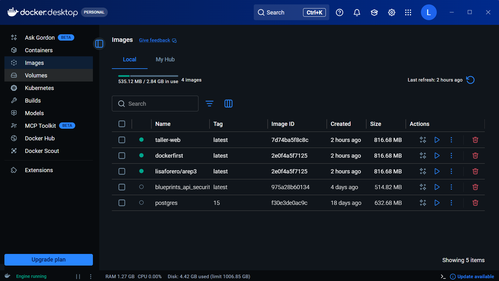
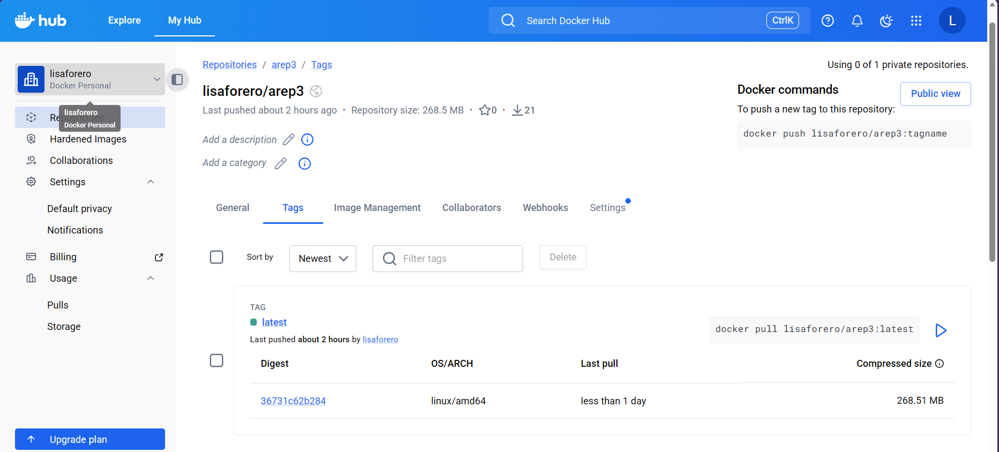

# Concurrent Web Framework and Introduction Docker

This project is a lightweight, custom Java-based web framework that combines annotation-based routing (IoC) with a binary-safe static file server. It includes an administrative dashboard implemented as index.html and is fully containerized using Docker and Docker Compose for distributed deployment.

## Architecture

The architecture is built upon a hybrid routing engine that manages both dynamic REST services and physical assets:

- **Request handling and parsing**: the HttpServer class manages a ServerSocket (configured on port 6000 for Docker compatibility). It uses a custom HTTP parser to extract URI paths and query parameters, wrapping them into HttpRequest objects.

- **Annotation-based IoC (Dynamic layer)**: inspired by [MicroSpringBoot](../MicroSpringBoot/), the framework uses Java Reflection to scan for @RestController and @GetMapping. It dynamically registers these methods into a routing map, allowing for modular controller design like HelloController and GreetingController.

- **Static resource resolver (File system)**: if a request does not match a dynamic endpoint, the engine switches to the static layer. It leverages the Java ClassLoader to fetch resources from the webroot directory. This ensures portability across different environments (local or containerized).

- **Binary-safe response stream**: to support media types such as .png or .css without corruption, the architecture utilizes a dual-output flow:

  - PrintWriter: for text-based dynamic responses and HTML.

  - BufferedOutputStream: for writing raw bytes of images and stylesheets directly to the socket, ensuring assets are delivered without corruption.

## Class design
 
- `HttpServer`: The core engine that handles multi-threaded socket connections.

- `GreetingController`: Implements dynamic logic using @RequestParam to personalize greetings.

- `HelloController`: Provides system-level endpoints such as /pi, /hello, /shutdown, and others.

- `App`: The bootstrap class that initializes component scanning and starts the service.

## Deployment and running

### 1. Prerequisites
- Java SDK 17 or higher.

- Apache Maven.

- Docker & Docker Compose.

### 2. Compilation and packaging
To prepare the binary and static resources:
```bash
mvn clean install
```

### 3. Docker image generation
To build the container image as required:
```bash
docker build --tag dockerfirst .
```

### 4. Verify that the image was built
```bash
docker images
```
### 4.1 Create from the built image an instance 
You can create from the created image an instance of a console-independent Docker container (option “-d”) with port 6000 bound to a physical port on your machine (option -p):
```bash
docker run -d -p 34000:6000 --name firstdockercontainer dockerfirst
```

### 5. Running with Docker Compose
```bash
docker-compose up -d
```

### 6. Verify that the services were created
```bash
docker ps
```



### 7. Publishing to Docker Hub

- Create a repository: Log in to Docker Hub and create a new repository (e.g., youruser/firstrepo).

- Create a reference to your local image using your repository name:
  ```bash
  docker tag dockerfirst youruser/firstsrepo
  ``` 
- Push the image to the repository on DockerHub:
  ```bash
  docker push youruser/firstsrepo:latest
  ```


  
